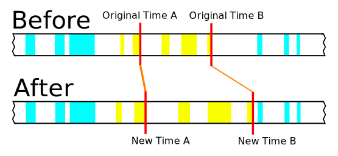

## Aegisub Timewarp

### What does this do?

This is a tool for manipulating timing in Aegisub. Say you've already subtitled a video but then find out that the version of the video you were subtitling against ran at 30fps when it's meant to run at 29.97fps. Or maybe you want to speed up a video to play at double speed and you need to update the subtitles to match.

This is done through the use of providing before and after times for two reference points, A and B. Times will be stretched linearly such that Original Time A becomes New Time A and Original Time B becomes New Time B. All selected lines will have their start/end times adjusted proportionally.

You can also just use this plugin as a more precise Shift Times, since Shift Times only works with centiseconds but this works with milliseconds. As long as the time between the two original points is the same duration as the time between the two new points, no stretching will occur, only shifting.

In the diagram above, the blue rectangles represent unselected lines and the yellow rectangles represent selected lines. The red lines represent the 4 reference times.

### Installation

To install, just copy `timewarp.lua` to your Aegisub Automation autoload directory. Restart Aegisub or do "Rescan Autoload Dir".

### Usage

First you need to choose two reference points. The reference points do not have to be at the beginning and end of the region you want to stretch, but the further apart the reference points are the more accurate the operation will be.

The easiest times to accurately match are scene changes. Locate a line that's meant to disappear at a scene change. The earlier in your video the better. Select it and press Ctrl+4 to jump to the last frame of the line. Make a note of the current time, this will be Original Time A. Now seek and step through the video to find the last frame before the scene change. Make a note of the current time, this will be New Time A.

Find another line that ends on a scene change, this time as late as possible. Do the same steps to record Original Time B and New Time B.

Select all the lines that you would like to modify. Go to Automation > Timewarp. Enter the four values you have recorded. The start and end times for all selected lines will be updated.